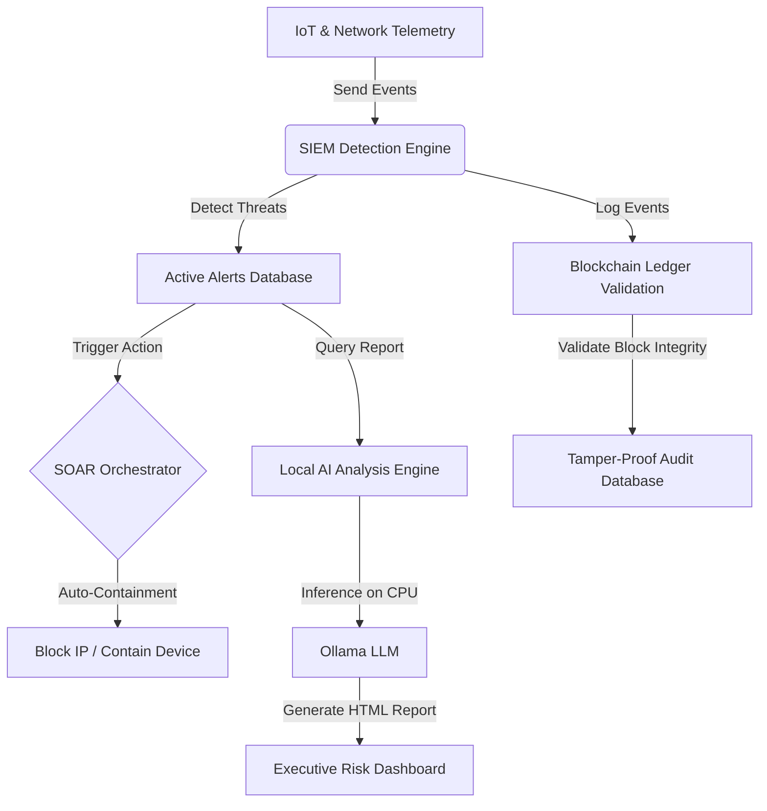

# ⚡ CypherGuard SOC Platform

[](https://www.python.org/)
[](https://vitejs.dev/)
[](https://tailwindcss.com/)
[](https://ollama.com/)
[](#)

CypherGuard is a premium, enterprise-grade Security Operations Center (SOC) platform designed for real-time security monitoring, automated orchestration, and local AI threat analysis. It integrates a Security Information and Event Management (SIEM) detection engine, a Security Orchestration, Automation, and Response (SOAR) response framework, and a secure tamper-proof Blockchain ledger to validate data integrity.

Designed with a high-fidelity slate dashboard visual system, CypherGuard brings corporate-level clarity and data-density (similar to CrowdStrike and Cloudflare) to device network telemetry.

---

## 🏗 System Architecture



---

## 🚀 Key Features

### 🔍 1. SIEM Detection Engine
Features 5 core security detection rules executing concurrently:
- **Brute Force Detection**: Flags repeated authentication failures.
- **Device Flooding Detection**: Mitigates Denial-of-Service (DoS) and port scanning telemetry.
- **Replay Attack Protection**: Inspects network frames for duplicate sequence tokens.
- **Key Rotation Auditing**: Flags expired cryptographic key states.
- **HMAC Verification**: Detects transmission tampering via checksum checks.

### ⚡ 2. SOAR Automation Playbooks
Automated incident response framework:
- **IP Containment**: Automatically blocks offending IP addresses in database network records.
- **Device Quarantine**: Isolates compromised IoT devices from the system.
- **Playbook Status**: Direct review of active containment actions.

### 🧠 3. Local AI Analysis (Ollama)
CPU-optimized offline intelligence for security reports:
- **Executive Risk Summaries**: Evaluates alerts and outputs detailed HTML incident reviews.
- **Native Visual Gauges**: Generates responsive CSS/SVG risk gauges (100% offline, zero external image requests).
- **GPU-Bypass Execution**: Configured to bypass CUDA/Vulkan driver incompatibilities, running stably on CPU with thread throttling.

### ⛓ 4. Tamper-Proof Blockchain Ledger
Ensures data-integrity of all logged SIEM events:
- **Block Serialization**: Generates SHA-256 block hashes linked in a chronological chain.
- **Genesis Block Validation**: Enforces deep validation, including the genesis block, ensuring no retroactive edits can bypass integrity audits.

### ⚙ 5. Settings Configuration
- **Thread Capping**: Set maximum CPU thread utilization for Ollama.
- **Threshold Tuning**: Adjust brute force, enumeration flooding, and HMAC failure limits.
- **System Maintenance**: Database reset, mock data seeding (populates last 7 days of charts), and database backup downloads.

---

## 🛠 Tech Stack

- **Backend**: Python 3.11, Flask, SQLAlchemy, SQLite, PyInstaller.
- **Frontend**: React 18, TypeScript, Vite, Tailwind CSS, Lucide Icons, Recharts.
- **Local AI**: Ollama (`gemma3:4b`, `llama3.2`, or `qwen2.5:0.5b`).

---

## 💾 Installation & Setup

### Option 1: Standalone Desktop Installer (Recommended)
1. Navigate to the `apps/` directory.
2. Double-click **`CypherGuard-Setup.exe`**.
3. Select your project folder, and click **INSTALL**.
4. The setup utility will automatically install the Python virtual environment, pull package dependencies, configure the database, install Ollama, and chain-launch the Control Panel.

### Option 2: Command-Line Installation
1. Ensure Python 3.11+ and Node.js are installed.
2. Open a terminal in the project root:
   ```bash
   # Set up backend virtual environment
   cd "Backend PBL"
   python -m venv venv
   venv\Scripts\activate
   pip install -r requirements.txt
   
   # Set up frontend packages
   cd "../Frontend PBL"
   npm install
   npm run build
   ```

---

## 💻 Running the Platform

1. In the project root folder, double-click **`CypherGuard-ControlPanel.exe`**.
2. Click **▶ START PLATFORM**. This will automatically:
   - Run the Flask backend on port `5000`.
   - Run the React/Vite dashboard on port `8088`.
   - Start the local Ollama background service in GPU-bypass CPU mode.
3. Click **🌐 Open Dashboard** to launch the React interface.
4. Click **■ STOP PLATFORM** to immediately terminate all services (uses process-tree termination to instantly clear child `node.exe` and `python.exe` processes).

---

## 📂 Project Structure

```text
CypherGuard/
├── CypherGuard-ControlPanel.exe   # Standalone Control Panel
├── Backend PBL/                   # Flask Python API & Engines
│   ├── app.py                     # Main application entry
│   ├── siem_engine.py             # SIEM rules detection
│   ├── soar_engine.py             # Playbook actions
│   └── blockchain_engine.py       # Ledger validation
├── Frontend PBL/                  # React dashboard code
│   ├── src/                       # Page layouts & components
│   └── vite.config.ts             # Port 8088 configuration
├── apps/                          # GUI Setup & packaging scripts
│   ├── CypherGuard-Setup.exe      # Standalone Setup Wizard
│   ├── installer_gui.py           # Setup script source
│   └── control_panel_gui.py       # Control Panel source
└── cypherguard.json               # Shared platform configuration
```

---

## 📄 License
This project is developed for Project-Based Learning (PBL) purposes. All rights reserved.
